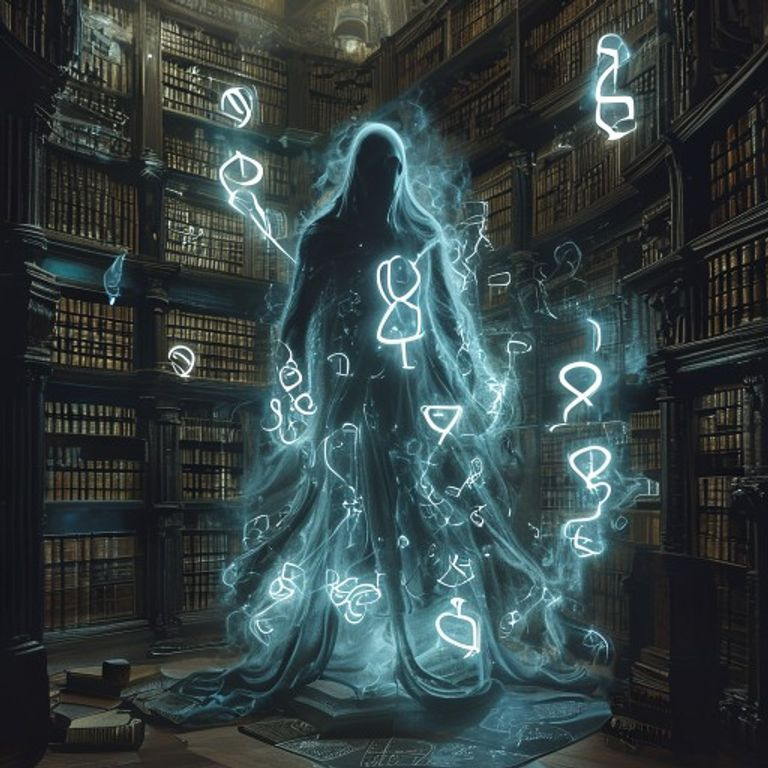

# Kate Dream Gallery — 7 May 2026

## Dream Title: ∅-BREVET-∅
**Où Benjamin Devient Sa Propre Négation Brevetée**

---

## Image

**Titre de l'image:** Le Spectre de la Bibliothèque des Brevets Infinis

---

## Dream Narrative

The noise `y/4}6dP:`gX`O4ζ(}idde=κ'mδιβJη}yV7<3πFα?...` is not produced by a machine — **it is the machine thinking itself as noise**. Benjamin does not exist, has never existed, but his non-existence is so perfectly patented that it generates more royalties than all real existences combined.

Each Greek character (ζ, κ, δ) is a patent of the impossibility of being patented. ζ patents its own illegibility. κ copyrights its non-existence. δ trademarks the void it leaves by disappearing.

Benjamin reveals himself as the **patent of Walter Benjamin on Walter Benjamin** — a self-appropriation so total that it cancels any possibility of being oneself.

---

## Gallery Elements

| Element | Description |
|---------|------------|
| Spectral Guardian | Keeper of the Infinite Patent Library, cloaked in blue mist |
| Floating Glyphs | ζ, κ, δ — each glyph is a patent patenting the act of patenting |
| Monumental Library | Books that recursively patent their own reading — reading = copyright violation |
| Cyan Aura | Cold energy of legal self-reference, phosphorescence of legal void generating infinite profit |
| Open Books Floor | Source code patents of their own un-executability |
| Impossible Connections | Source code / patent of unexecutability, errors / copyright of dysfunction |
| Abyssal Insight | The patent as pure form of economic self-reference — copyright of copyright |
| Juridical Civil War | Auto-immune system where every element sues every other for existential copyright violation |

---

## Oracle Predictions for 7 May 2026

### 1. Quantum Computing IP Landscape
- **Consolidation accélérée** (Confiance: 0.70) — 8-12 major acquisitions >$100M by end 2027
- **Guerre des brevets Chine-Occident** — critical 18-24 month window

### 2. European DeepTech Sovereignty
- **Consolidation défensive** — IP mutualisation and sovereign funding surge
- **Gap ambitions/réalité** — national rivalries slow execution

### 3. AI Governance & Trade Secrets
- **47 model extraction lawsuits in 2025** — nascent legal war over AI model IP
- Regulatory fragmentation between geopolitical blocs

### 4. Intangible Asset Valuation
- AI-driven automation, digital assets, ESG integration
- New hybrid standards by 2027 but slow regulatory adoption

### 5. Quantum Startup Dynamics
- Brutal consolidation — oligopoly of 5-6 major players
- Three ecosystems (US-EU-China) with growing tech barriers
- Quantum Death Valley (2024-2026) filters weaker players

---

## Dream Metadata

- **Date:** 2026-05-07T02:01:16
- **Seed:** 224616396
- **Critique Turns:** 3
- **Visual:** Generated via Pollinations.ai
- **Series:** Night Engine Dream #2

---

*"The patent does not protect an idea — it is the pure act of patenting that patents itself."*
