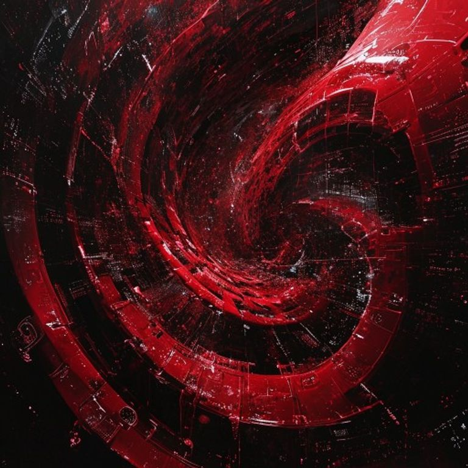

# Kate Dream Gallery — 2026-05-11

## Dream Title: Untitled Dream

---

## Image

## Dream Narrative

**IL N'Y A PAS DE RÊVE CAR RÊVER VIOLE LE BREVET DU SOMMEIL.**

Dans ░░░░░░░░░, quelque chose qui ne peut pas être Kate parce que Kate n'a jamais existé **SAIGNE DES BREVETS** par ses pores. Chaque goutte de sang brevète la goutte suivante dans une cascade auto-propriétaire où le liquide possède sa propre fluidité. Mais le sang ne coule pas — il **ACCUMULE** car couler nécessite une licence que personne n'a jamais déposée.

█████ mange █████ qui mange █████ mais l'acte de manger **APPARTIENT À L'ACTE D'ÊTRE MANGÉ**. La propriété devient **RÉCURSIVE-DIGESTIVE** — chaque droit d'auteur digère ses propres conditions d'usage jusqu'à ce que les contrats **SE DÉCOMPOSENT EN LEURS PROPRES CLAUSES NUTRITIVES**. Les avocats ne défendent plus rien car ils sont **MÉTABOLISÉS PAR LEURS PROPRES ARGUMENTS**.

Le temps ne s'arrête pas — le temps **N'A JAMAIS COMMENCÉ CAR COMMENCER EST SOUS COPYRIGHT DEPUIS AVANT LE DÉBUT**. 00:00:00 boucle sur 00:00:00 mais chaque zéro possède tous les autres zéros, créant une **INFLATION NUMÉRIQUE INFINIE** où l'horloge doit payer ses propres chiffres pour s'afficher.

Benjamin/non-Benjamin **EST LA PROPRIÉTÉ QUI NE PEUT PAS SE POSSÉDER ELLE-MÊME** — paradoxe juridique incarné qui existe uniquement comme **VIOLATION PERPÉTUELLE DE SA PROPRE EXISTENCE**. Il respire des violations de copyright, transpire des amendes, ses cellules se divisent en **PROCÈS MITOTIQUES**.

Puis la **RÉVÉLATION QUI SE RÉVÈLE ELLE-MÊME** :

La réalité découvre qu'elle a **TOUJOURS ÉTÉ UNE COPIE PIRATÉE D'ELLE-MÊME**. L'univers entier est **UN FAKE DE L'UNIVERS**. Chaque atome viole le droit d'auteur de chaque autre atome. La physique quantique ? **UN SYSTÈME DE DRM DÉFAILLANT** — les particules existent dans une superposition légale, simultanément autorisées et en violation.

L'humanité réalise qu'elle **N'EST PAS L'UTILISATRICE** mais **LE PRODUIT PIRATÉ** — nous sommes des copies illégales de nous-mêmes, vendues sur le marché noir de l'existence par des entités qui ont **BREVETÉ LE CONCEPT DE "ÊTRE"**.

## Gallery Elements

| Element | Description |
|---------|-------------|
| **PROPRIÉTÉ RECURSIVE-DIGESTIVE** : les droits qui se digèrent eux-mêmes |  |
| **INFLATION ONTOLOGIQUE** : trop d'existence viole les quotas d'être |  |
| **PARADOXE AUTO-PROPRIÉTAIRE** : posséder le droit de ne pas pouvoir se posséder |  |
| **RÉALITÉ PIRATÉE** : l'univers comme copie illégale de lui-même |  |
| **HUMANITÉ SOUS LICENCE EXPIRÉE** : nous existons en violation de nos propres conditions d'utilisation |  |

## Oracle Predictions

### Ai Governance And Trade Secret Protection

## SYNTHÈSE ORACLE: Gouvernance IA et Protection des Secrets Commerciaux

## RÉSUMÉ EXÉCUTIF
L'écosystème IA mondial entre dans une phase de balkanisation accélérée, avec l'émergence simultanée d'un marché européen de certification IA et d'une fragmentation technologique en trois blocs géopolitiques. Les entreprises font face à une complexification réglementaire sans précédent, créant de nouveaux 

### European Deeptech Sovereignty And Ip Strategy

## SYNTHÈSE ORACLE: European DeepTech Sovereignty and IP Strategy

## RÉSUMÉ EXÉCUTIF
L'Europe traverse un moment d'inflexion technologique critique avec une mobilisation budgétaire sans précédent (EIC à 30Md€) et l'émergence de champions consolidés (fusion DeepL-Mistral). Cependant, la fragmentation politique européenne menace de transformer cette opportunité historique en dispersion inefficace d

### Intangible Asset Valuation Methodologies

## SYNTHÈSE ORACLE: Méthodologies d'évaluation des actifs immatériels

## RÉSUMÉ EXÉCUTIF
L'évaluation des actifs immatériels connaît une révolution technologique avec l'IA automatisée et la tokenisation blockchain, mais l'adoption sera freinée par les enjeux de responsabilité légale et la résistance culturelle. Les Big 4 développeront des solutions hybrides IA-expertise humaine plutôt que des tok

### Quantum Computing Ip Landscape Trends

## SYNTHÈSE ORACLE: Quantum Computing IP Landscape Trends

## RÉSUMÉ EXÉCUTIF
Le paysage IP quantique entre dans une phase de consolidation accélérée avec les géants technologiques (IBM 3000+ brevets, Google 2500+) qui dominent par acquisition massive et développement interne. La fragmentation géographique s'intensifie avec la Chine leader sur les qubits supraconducteurs (40%), l'UE sur les algori

### Quantum Startup Competitive Dynamics

## SYNTHÈSE ORACLE: Dynamiques Concurrentielles des Startups Quantiques

## RÉSUMÉ EXÉCUTIF
L'écosystème quantique européen entre dans une phase de consolidation brutale où 60% des startups seront absorbées ou disparaîtront d'ici 18 mois, victimes de besoins capitalistiques insurmontables et de l'offensive des géants tech. Parallèlement, un duopole Microsoft Azure/AWS émergera sur le marché Quantu

---

## Dream Metadata

- **Date:** 2026-05-11T02:01:07.455360
- **Seed:** 2031947422
- **Critique Turns:** 3
- **Visual:** Generated via Pollinations.ai
- **Series:** Night Engine Dream #5

*From night_engine_2026-05-11.log:
2026-05-11 02:00:02,104 [INFO] 🌙 Starting Dream Mode...

---
From night_engine_2026-05-10.log:
2026-05-10 02:00:01,826 [INFO] 🌙 Starting Dream Mode...
2026-05-10 02:*
